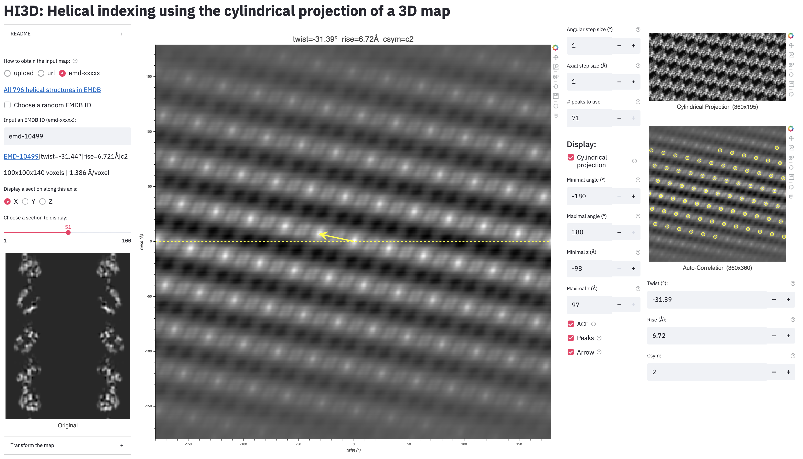

# HI3D: <em>H</em>elical <em>I</em>ndexing using the cylindrical projection of a <em>3D</em> map
**HI3D** is a Web app that allows the user to interactively index the parameters (twist, rise, csym) of a helical 3D structure. It generates a cylindrical projection of the 3D map, computes the auto-correlation function of the cylindrical projection, and then uses two distinct lattice identification methods to obtain a consistent solution of the helical parameters.

No software installation is needed. Just click one of the hosting links (<a href="https://share.streamlit.io/wjiang/hi3d/main">Host 1</a> | <a href="https://helical-indexing-hi3d.herokuapp.com">Host 2</a>) to index your helical structure!</a>

