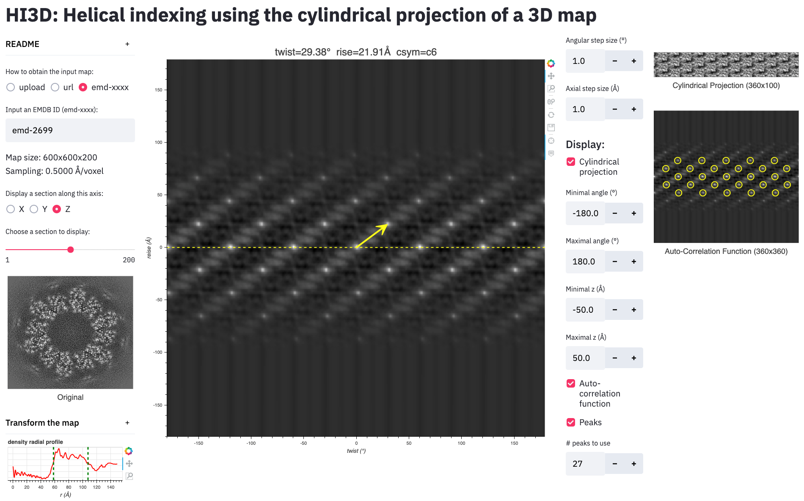

# Helical indexing using the cylindrical projection of a 3D map
This Web app uses [Streamlit](https://www.streamlit.io) to provide an interactive online tool that can index helical parameters (twist, rise, csym) by generating a cylindrical projection of the 3D map, computing the auto-correlation function of the cylindrical projection, and then using two distinct lattice identification methods to obtain a consistent solution of the helical parameters.

Click one of the hosting links (<a href="https://helical-indexing-3dmap.herokuapp.com">Host 1</a> | <a href="https://share.streamlit.io/wjiang/helical-indexing-3dmap/main">Host 2</a>) to index your helical structure!</a>

