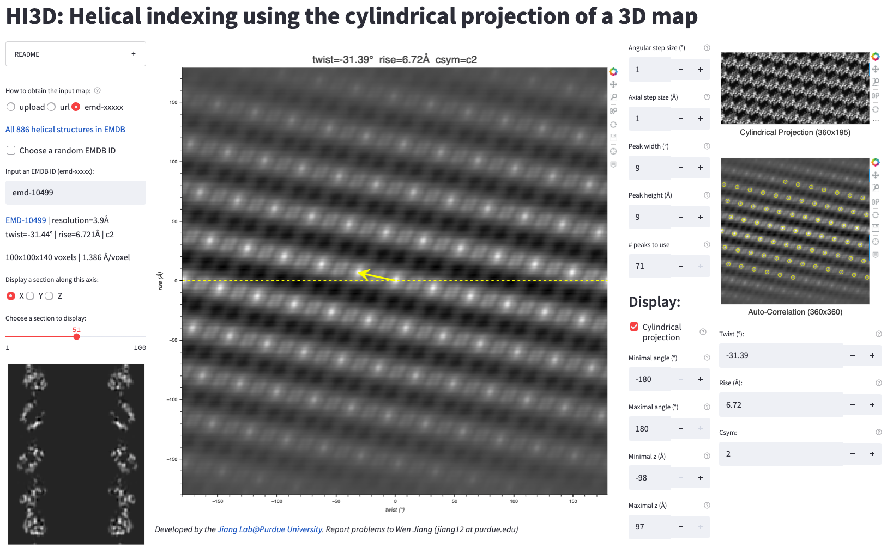

# HI3D: <em>H</em>elical <em>I</em>ndexing using the cylindrical projection of a <em>3D</em> map

**Publication**: Sun, C., Gonzalez, B., & Jiang, W. (2022). [Helical Indexing in Real Space](https://doi.org/10.1038/s41598-022-11382-7). Scientific Reports, 12(1), 1–11. 

**HI3D** is a Web app that allows the user to interactively index the parameters (twist, rise, csym) of a helical 3D structure. It generates a cylindrical projection of the 3D map, computes the auto-correlation function of the cylindrical projection, and then uses two distinct lattice identification methods to obtain a consistent solution of the helical parameters.

No software installation is needed. Just [click me](https://jianglab-hi3d-streamlit-app-902emw.streamlitapp.com) to index your helical structure!</a>

